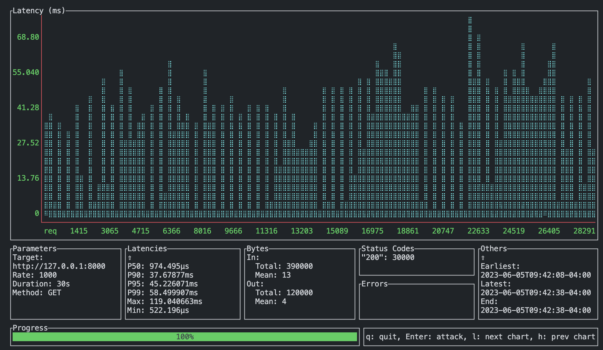
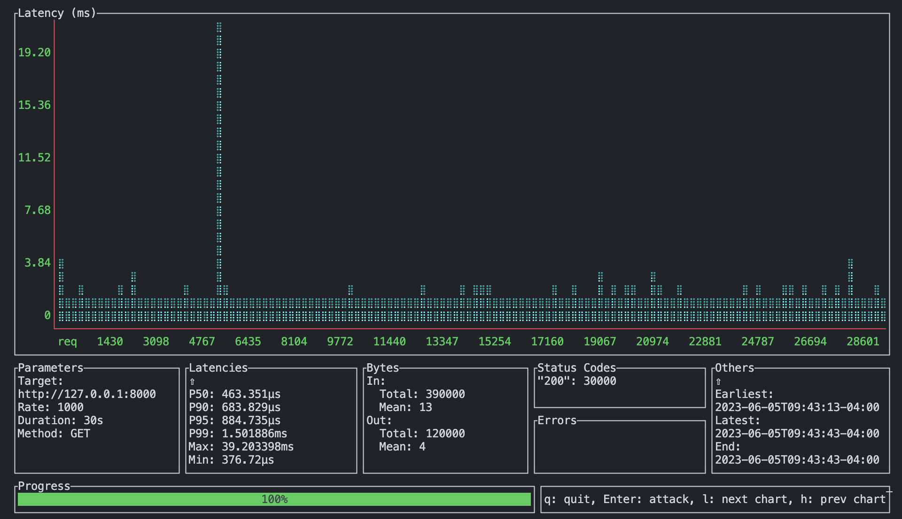

# spvn


[](https://github.com/charliermarsh/ruff)
[](https://pypi.org/project/spvn)
[](https://pypi.org/project/spvn)

---

Rust ASGI bindings for python.

## Features

- Drop and go CLI for replacing transport layer handling
- ASGI compliant protocols allowing direct import and use of python through rust
- Fast

## Sneak Peek

**fastapi before**

**fastapi after**


- _p99 @ 38x_

## Rationale & Goals

- Relieve limits by python in networking applications
- Safe python threadpooling

- Uvicorn drops requests & stalls on IO > 7500 concurrent clients
- Hypercorn drops requests & stalls on IO > 7500 concurrent clients

In both, we must horizontally scale to accomodate these limits in our systems. This is further accompanied by essentially a second layer of IO bound processes, which are evidently unable to maintain highly concurrent environments

## What spvn does

Delegation of connection multiplex, stream, and IO processes into Rust, and autoinjection at runtime following standard ASGI protocol.

## Performance

Tests performed using [ali](https://github.com/nakabonne/ali). See [docs/ali](./docs/ali/README.md) for methodology.

### _spvn @ 1000 reqs/s, 30s sustained_


- app: fastapi
- file: dotest.bit:app

### _spvn @ 5000 reqs/s_


- app: custom
- file: dotest.baz:app

### _spvn @ 10000 reqs/s_


- app: custom
- file: dotest.baz:app

### _uvicorn @ 1000 reqs/s_


- app: custom
- file: dotest.baz:app

### _uvicorn @ 5000 reqs/s (DDOS Success)_


- app: custom
- file: dotest.baz:app

### _hypercorn @ 1000 reqs/s_


- app: custom
- file: dotest.baz:app

### _hypercorn @ 5000 reqs/s (DDOS Success)_


- app: custom
- file: dotest.baz:app

## Installation

**spvn is offered as _beta_ currently, keep in mind it has quirks and some features might be untested. for this reason, we dont recommend it for production use yet. if you find a bug, please submit an issue!**

### pypi

[](https://pypi.org/project/spvn)

`pip install spvn`

### crates

| spvn          | [](https://crates.io/crates/spvn)                   |
| ------------- | --------------------------------------------------------------------------------------------------------------------------- |
| spvn_caller   | [](https://crates.io/crates/spvn_caller)     |
| spvn_lifespan | [](https://crates.io/crates/spvn_lifespan) |

## Developing

## Project Status

Roughly in order of priority

- [✅] Integrate standard import semantics

- [✅] PyCaller
  - [✅] (rust) Async safe integration
  - [✅] Abstract (py fn) async / sync handle
  - [✅] Caller pool [this will be revised, its too slow]
- [✅] Standard asgi traits & structs
  - [✅] ASGIScope
    - [✅] (rust) Async safe integration
    - [✅] Conversion from `tower::Body` -> `dict`
  - [✅] ASGIVersion
  - [✅] ASGIMessage
    - [✅] Lifecycle Scope
    - [✅] HTTP Lifecycle Scope
    - [🚧] Websockets (msg integration)
- [✅] App listener
- [✅] App dispatcher
  - [✅] Async threadsafe
  - [🚧] Lifecycle activation for caller objects (unstable)
- [🚧] App scheduler

  - [✅] Injectable `awaitables` (rust ptr -> python ptr)
  - [✅] Async threadsafe
  - [✅] Delayed py-fn call
  - [🚧] Scheduler into py

- [🚧] Live reloader
- [🚧] Websockets

### Pre-requisites

#### Python >= 3.9

1. Use virtualenv / venv

```bash
python3.10 -m (venv|virtualenv) env && \
        . ./env/bin/activate && \
        pip install maturin
```

2. Test bindings by running

```bash
maturin develop
```

#### Rust >= 1.69.0

- Build CLI

```bash
cargo build
```

- Run CLI

```bash
cargo cli serve dotest.foo:app
```
