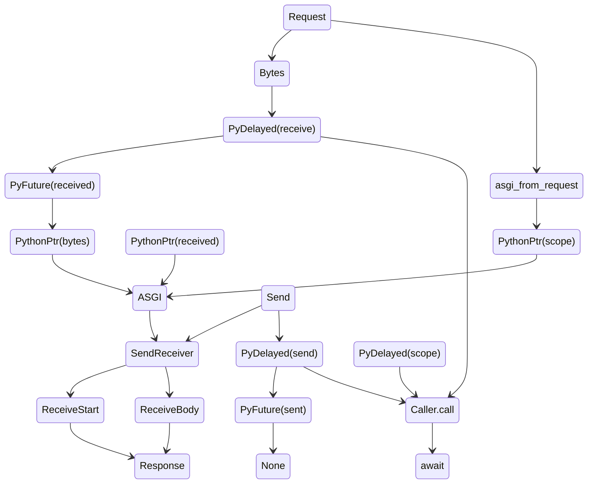

[](https://github.com/charliermarsh/ruff)
[](https://pypi.org/project/spvn)
[](https://pypi.org/project/spvn)

---

# spvn

spvn is a work in progress project which seeks to bring rust asgi bindings into python. it is in progress, contributions & development are welcome

## ASGI State Management



## Project Status

Roughly in order of priority

- [✅] Integrate standard import semantics

- [🚧] PyCaller
  - [✅] (rust) Async safe integration
  - [✅] Abstract (py fn) async / sync handle
  - [🚧] Caller pool
- [🚧] Standard asgi traits & structs
  - [🚧] ASGIScope
    - [✅] (rust) Async safe integration
    - [🚧] Conversion from `tower::Body` -> `dict`
  - [✅] ASGIVersion
  - [🚧] ASGIMessage
    - [✅] Lifecycle Scope
    - [✅] HTTP Lifecycle Scope
    - [🚧] Websockets (msg integration)
- [✅] App listener
- [🚧] App dispatcher
  - [✅] Async threadsafe
  - [🚧] Lifecycle activation for caller objects
- [🚧] App scheduler

  - [✅] Injectable `awaitables` (rust ptr -> python ptr)
  - [✅] Async threadsafe
  - [✅] Delayed py-fn call
  - [🚧] Scheduler into py

- [🚧] Live reloader
- [🚧] Websockets

## Rationale & Goals

- Relieve limits by python in networking applications
  - The goal is not to create the 'fastest' ASGI server, but reliable ASGI services which don't drop calls when subject to extreme concurrency
- Safe python threadpooling unmanaged by GIL runtime

### Claims

The upper bounds of python concurrency are not <i>really</i> production ready

#### Rationale

- Uvicorn drops requests & stalls on IO > 7500 concurrent clients
- Hypercorn drops requests & stalls on IO > 7500 concurrent clients

In both, we must horizontally scale to accomodate these limits in our systems. This is further accompanied by essentially a second layer of IO bound processes, which are evidently unable to maintain highly concurrent environments

#### Proposed

Delegation of connection multiplex, stream, and IO processes into Rust, and autoinjection at runtime following standard ASGI protocol.

### Preliminary Tests

- perf has test files containing basic benchmarks
  - hypercorn @ 1 worker = 683402-788307 ns
  - spvn -> py @ 1 worker = 395430-727142 ns

This is still too slow, but is a <i>very</i> preliminary implementation of the caller protocol using sync processes. The intented scope is to bring methods into async runtimes, allowing for concurrent continuous calls without dropping connections or locks due to IO bound processes.

## Developing

### Pre-requisites

#### Python >= 3.9

1. Use virtualenv / venv

```bash
python3.10 -m (venv|virtualenv) env && \
        . ./env/bin/activate && \
        pip install maturin
```

2. Test bindings by running

```bash
maturin develop
```

#### Rust >= 1.69.0

- Build CLI

```bash
cargo build
```

- Run CLI

```bash
target/debug/spvn serve dotest.foo:app
```

## pypi

[](https://pypi.org/project/spvn)

-> `pip install spvn`

-> `spvn serve foo.bar:app` (dev)

## crates

| spvn          | [](https://crates.io/crates/spvn)                   |
| ------------- | --------------------------------------------------------------------------------------------------------------------------- |
| spvn_caller   | [](https://crates.io/crates/spvn_caller)     |
| spvn_listen   | [](https://crates.io/crates/spvn_listen)     |
| spvn_lifespan | [](https://crates.io/crates/spvn_lifespan) |
