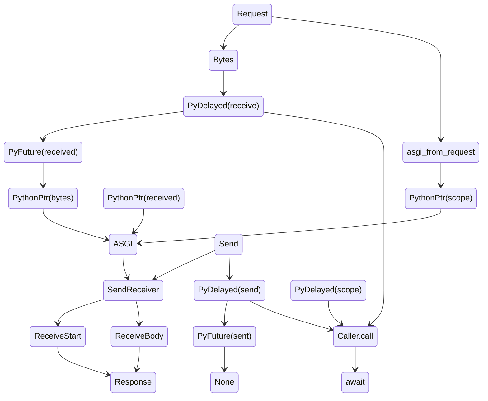

[](https://github.com/charliermarsh/ruff)
[](https://pypi.org/project/spvn)
[](https://pypi.org/project/spvn)

---

# spvn

spvn is a work in progress project which seeks to bring rust asgi bindings into python. it is in progress, contributions & development are welcome

## ASGI State Management



## Project Status

Roughly in order of priority

- [✅] Integrate standard import semantics

- [✅] PyCaller
  - [✅] (rust) Async safe integration
  - [✅] Abstract (py fn) async / sync handle
  - [✅] Caller pool [this will be revised, its too slow]
- [🚧] Standard asgi traits & structs
  - [🚧] ASGIScope
    - [✅] (rust) Async safe integration
    - [🚧] Conversion from `tower::Body` -> `dict`
  - [✅] ASGIVersion
  - [🚧] ASGIMessage
    - [✅] Lifecycle Scope
    - [✅] HTTP Lifecycle Scope
    - [🚧] Websockets (msg integration)
- [✅] App listener
- [🚧] App dispatcher
  - [✅] Async threadsafe
  - [🚧] Lifecycle activation for caller objects
- [🚧] App scheduler

  - [✅] Injectable `awaitables` (rust ptr -> python ptr)
  - [✅] Async threadsafe
  - [✅] Delayed py-fn call
  - [🚧] Scheduler into py

- [🚧] Live reloader
- [🚧] Websockets

## Rationale & Goals

- Relieve limits by python in networking applications
  - The goal is not to create the 'fastest' ASGI server, but reliable ASGI services which don't drop calls when subject to extreme concurrency
- Safe python threadpooling unmanaged by GIL runtime

### Claims

The upper bounds of python concurrency are not <i>really</i> production ready

#### Rationale

- Uvicorn drops requests & stalls on IO > 7500 concurrent clients
- Hypercorn drops requests & stalls on IO > 7500 concurrent clients

In both, we must horizontally scale to accomodate these limits in our systems. This is further accompanied by essentially a second layer of IO bound processes, which are evidently unable to maintain highly concurrent environments

#### Proposed

Delegation of connection multiplex, stream, and IO processes into Rust, and autoinjection at runtime following standard ASGI protocol.

### Preliminary Tests

- perf has test files containing basic benchmarks
  - hypercorn @ 1 worker = 683402-788307 ns
  - spvn -> py @ 1 worker = 159201-221808 ns

This is a <i>very</i> preliminary implementation of the caller protocol using async processes.

#### Visualization

Tests performed using [ali](https://github.com/nakabonne/ali). See [perf/ali](./perf/ali/README.md) for methodology.


_spvn @ 5000 reqs/s_


_spvn @ 10000 reqs/s_


_uvicorn @ 1000 reqs/s_


_uvicorn @ 5000 reqs/s (DDOS Success)_


_hypercorn @ 1000 reqs/s_


_hypercorn @ 5000 reqs/s (DDOS Success)_

## Developing

### Pre-requisites

#### Python >= 3.9

1. Use virtualenv / venv

```bash
python3.10 -m (venv|virtualenv) env && \
        . ./env/bin/activate && \
        pip install maturin
```

2. Test bindings by running

```bash
maturin develop
```

#### Rust >= 1.69.0

- Build CLI

```bash
cargo build
```

- Run CLI

```bash
target/debug/spvn serve dotest.foo:app
```

## pypi

[](https://pypi.org/project/spvn)

-> `pip install spvn`

-> `spvn serve foo.bar:app` (dev)

## crates

| spvn          | [](https://crates.io/crates/spvn)                   |
| ------------- | --------------------------------------------------------------------------------------------------------------------------- |
| spvn_caller   | [](https://crates.io/crates/spvn_caller)     |
| spvn_listen   | [](https://crates.io/crates/spvn_listen)     |
| spvn_lifespan | [](https://crates.io/crates/spvn_lifespan) |
