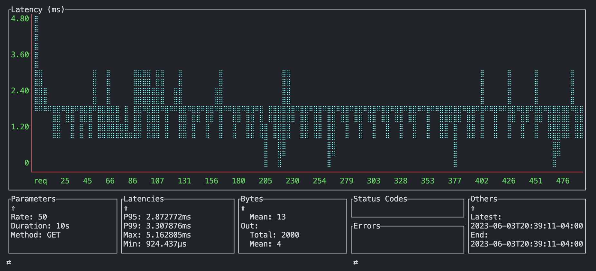
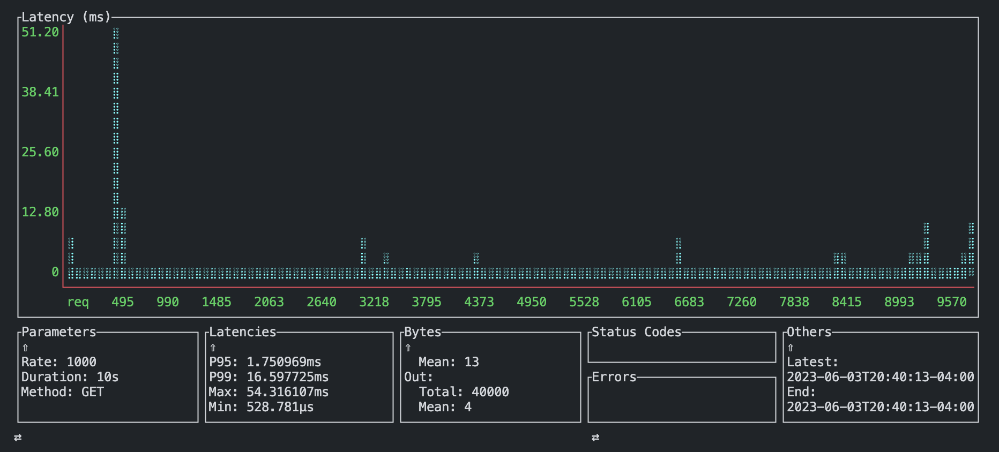
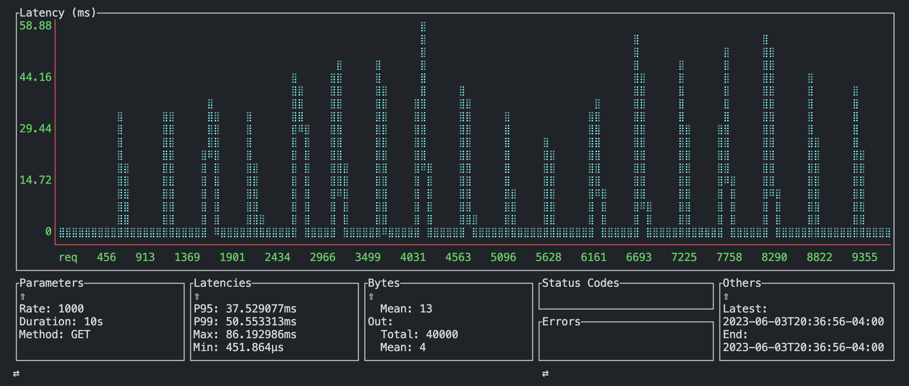
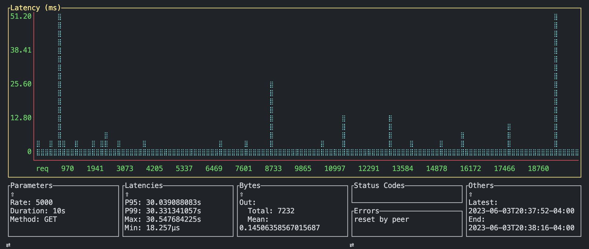
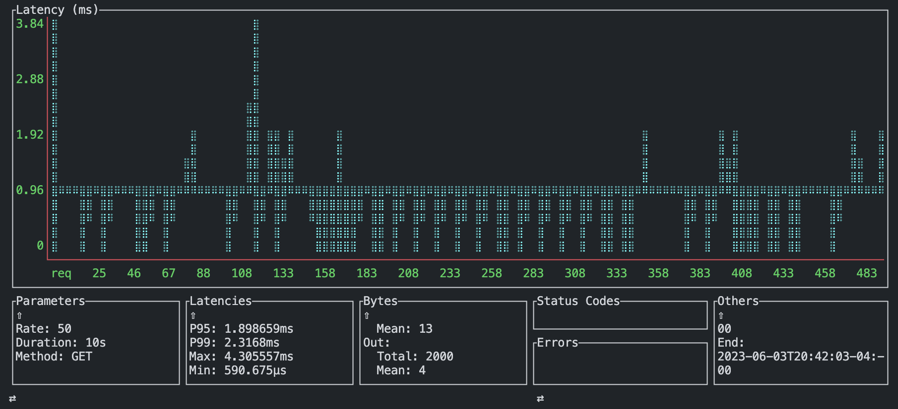

# Preliminary Performance

Tests performed using [ali](https://github.com/nakabonne/ali).

## Methodology

Request with 4 byte payload, and common ASGI app executing the following:

```py

async def app(scope, receive, send):
    await receive() # added: receive the full payload
    await send({
        'type': 'http.response.start',
        'status': 200,
        'headers': [
            (b'content-type', b'text/plain'),
        ],
    }) # send a start callback
    await send({
        'type': 'http.response.body',
        'body': b'Hello, world!',
    }) # send a body
```

_modified from uvicorn docs_

## Execution

### 50 req / s

```bash
ali http://127.0.0.1:8000 -b body --rate=50
```

### 500 req / s

```bash
ali http://127.0.0.1:8000 -b body --rate=500
```

### 1000 req / s

```bash
ali http://127.0.0.1:8000 -b body --rate=1000
```

### 5000 req / s

```bash
ali http://127.0.0.1:8000 -b body --rate=5000
```

## Commands

### uvicorn

```bash
uvicorn dotest.baz:app
```

### hypercorn

```bash
hypercorn dotest.baz:app
```

### spvn

```bash
spvn serve --target dotest.baz:app
```

## Results


_hypercorn @ 50 reqs/s_


_hypercorn @ 500 reqs/s_


_hypercorn @ 1000 reqs/s_


_hypercorn @ 5000 reqs/s (crash / ddos thresh)_


_uvicorn @ 50 reqs/s_


_uvicorn @ 500 reqs/s_


_uvicorn @ 1000 reqs/s_


_uvicorn @ 5000 reqs/s (crash / ddos thresh)_


_spvn @ 50 reqs/s_


_spvn @ 500 reqs/s_


_spvn @ 1000 reqs/s_


_spvn @ 5000 reqs/s_


_spvn @ 10000 reqs/s (dropped requests but continued service <130ms P95)_
